# Wireframe
## Overview
The wireframe serves as a blueprint for the user interface (UI) of the application. It outlines the layout, structure, and functionality of the app's key screens, providing a visual guide for the design and development process.

## Key Components
1. **Header**
   - Logo
   - Navigation Menu
   - User Profile Access

2. **Main Content Area**
   - Dashboard Overview
   - Key Metrics and KPIs
   - Recent Activity Feed

3. **Sidebar**
   - Quick Links
   - Notifications
   - User Settings

4. **Footer**
   - Contact Information
   - Legal Links
   - Social Media Links

## User Flow
1. User logs in and is directed to the dashboard.
2. User can access different sections via the navigation menu.
3. Key actions are highlighted for easy access.

```mermaid
graph TD
    A[System Tray Icon] -->|Double-click| B[Main Window - Dashboard]
    A -->|Right-click Menu| A1[Start/Stop/Exit]
    
    B --> C[Dashboard Tab]
    B --> D[Logs Tab]
    B --> E[Settings Tab]
    B --> F[About Tab]
    
    C --> C1[Status Indicator]
    C --> C2[Real-time Metrics Panel]
    C --> C3[Performance Charts]
    C --> C4[Control Bar]
    
    C4 --> C4A[Start/Stop Button]
    C4 --> C4B[Pause Button]
    C4 --> C4C[Profile Selector]
    C4 --> C4D[Export Report]
    
    D --> D1[Log Viewer]
    D --> D2[Severity Filter]
    D --> D3[Search/Copy Actions]
    
    E --> E1[Profile Management]
    E --> E2[Advanced Settings]
    E --> E3[Theme Selector]
    E --> E4[Update Settings]
    
    E1 --> E1A[Home Profile]
    E1 --> E1B[Office Profile]
    E1 --> E1C[Gaming Profile]
    E1 --> E1D[Custom Profiles]
    
    E2 --> E2A[DNS Configuration]
    E2 --> E2B[Monitoring Aggressiveness]
    E2 --> E2C[Notification Settings]
    E2 --> E2D[Performance Thresholds]
    
    F --> F1[Version Info]
    F --> F2[Check for Updates]
    F --> F3[Documentation Links]
    F --> F4[Community/Support]
    
    style A fill:#1a73e8,color:#fff
    style B fill:#34a853,color:#fff
    style C fill:#fbbc04,color:#000
    style D fill:#ea4335,color:#fff
    style E fill:#9aa0a6,color:#fff
```

Wireframes Conceptuales de OptiGemini v3.0
1. Main Window - Dashboard Tab (Estado: Monitoring Active)
┌─────────────────────────────────────────────────────────────────────┐
│ OptiGemini v3.0                                    🌙 ⚙️ ❓ ✕         │
├─────────────────────────────────────────────────────────────────────┤
│                                                                      │
│  ┌────────────────────────────────────────────────────────────┐    │
│  │  ●  CONNECTION STATUS: OPTIMAL                              │    │
│  │     Monitoring Active • Gaming Profile • Last check: 2s ago │    │
│  └────────────────────────────────────────────────────────────┘    │
│                                                                      │
│  ┌──────────────────┐  ┌──────────────────┐  ┌──────────────────┐  │
│  │   LATENCY        │  │   JITTER         │  │   PACKET LOSS    │  │
│  │                  │  │                  │  │                  │  │
│  │      24 ms       │  │      3 ms        │  │      0.0%        │  │
│  │   ▲ Excellent    │  │   ▲ Good         │  │   ▲ Perfect      │  │
│  └──────────────────┘  └──────────────────┘  └──────────────────┘  │
│                                                                      │
│  ┌──────────────────┐  ┌──────────────────────────────────────┐    │
│  │   PUBLIC IP      │  │   ACTIVE ADAPTER                      │    │
│  │                  │  │                                        │    │
│  │  203.0.113.42    │  │   Wi-Fi 6 (Intel AX201)               │    │
│  │  📋 Copy         │  │   Signal: Excellent                   │    │
│  └──────────────────┘  └──────────────────────────────────────┘    │
│                                                                      │
│  ┌────────────────────────────────────────────────────────────┐    │
│  │  PERFORMANCE CHARTS (Last 5 Minutes)                        │    │
│  │                                                              │    │
│  │  Latency (ms)                                                │    │
│  │  60 ┤                                                        │    │
│  │  40 ┤        ╭╮                                              │    │
│  │  20 ┤╭───────╯╰──────────────╮                              │    │
│  │   0 ┴─────────────────────────┴──────────────────────       │    │
│  │     ⏸ Pause Updates          📊 Expand                      │    │
│  └────────────────────────────────────────────────────────────┘    │
│                                                                      │
│  ┌────────────────────────────────────────────────────────────┐    │
│  │  [●  STOP MONITORING]  [❚❚ PAUSE]  [Gaming ▼]  [📤 Export] │    │
│  └────────────────────────────────────────────────────────────┘    │
│                                                                      │
│ [Dashboard] [Logs] [Settings] [About]                               │
└─────────────────────────────────────────────────────────────────────┘

2. Main Window - Logs Tab
┌─────────────────────────────────────────────────────────────────────┐
│ OptiGemini v3.0                                    🌙 ⚙️ ❓ ✕         │
├─────────────────────────────────────────────────────────────────────┤
│                                                                      │
│  EVENT LOGS                                                          │
│                                                                      │
│  Filter: [All ▼] [INFO] [WARN] [ERROR]    🔍 Search  📋 Copy  📁 Open│
│                                                                      │
│  ┌────────────────────────────────────────────────────────────┐    │
│  │ 🟢 14:23:42 [INFO]  Monitoring started (Gaming profile)     │    │
│  │ 🟢 14:23:45 [INFO]  Connection test: 24ms latency, 0% loss  │    │
│  │ 🟢 14:23:48 [INFO]  Connection test: 26ms latency, 0% loss  │    │
│  │ 🟡 14:24:12 [WARN]  Latency spike detected: 156ms          │    │
│  │ 🟢 14:24:15 [INFO]  Connection stabilized: 28ms            │    │
│  │ 🟢 14:24:18 [INFO]  DNS servers responding normally        │    │
│  │ 🟢 14:24:21 [INFO]  Connection test: 25ms latency, 0% loss  │    │
│  │ 🟡 14:25:03 [WARN]  Brief connection interruption detected  │    │
│  │ 🟢 14:25:04 [INFO]  Recovery action: Adapter refresh        │    │
│  │ 🟢 14:25:06 [INFO]  Connection restored: 27ms latency       │    │
│  │ 🟢 14:25:09 [INFO]  Connection test: 24ms latency, 0% loss  │    │
│  │ ⋮                                                            │    │
│  │                                                              │    │
│  │                                                              │    │
│  └────────────────────────────────────────────────────────────┘    │
│                                                                      │
│  Auto-scroll: [✓]    Log Level: [INFO ▼]    Rotate: [Daily ▼]      │
│                                                                      │
│ [Dashboard] [Logs] [Settings] [About]                               │
└─────────────────────────────────────────────────────────────────────┘

3. Main Window - Settings Tab
┌─────────────────────────────────────────────────────────────────────┐
│ OptiGemini v3.0                                    🌙 ⚙️ ❓ ✕         │
├─────────────────────────────────────────────────────────────────────┤
│                                                                      │
│  SETTINGS                                                            │
│                                                                      │
│  ┌─ PROFILES ─────────────────────────────────────────────────┐    │
│  │                                                              │    │
│  │  Active Profile: [Gaming ▼]                                 │    │
│  │                                                              │    │
│  │  ┌──────────────┐ ┌──────────────┐ ┌──────────────┐        │    │
│  │  │  🏠 Home     │ │  💼 Office   │ │  🎮 Gaming   │        │    │
│  │  │   Balanced   │ │   Power Save │ │   Aggressive │        │    │
│  │  │              │ │              │ │   ● Active   │        │    │
│  │  └──────────────┘ └──────────────┘ └──────────────┘        │    │
│  │                                                              │    │
│  │  [+ Create New Profile]                                     │    │
│  └──────────────────────────────────────────────────────────────    │
│                                                                      │
│  ┌─ MONITORING ───────────────────────────────────────────────┐    │
│  │                                                              │    │
│  │  Check Interval:  [●─────────────] 3 seconds               │    │
│  │                   ←Less Aggressive    More Aggressive→      │    │
│  │                                                              │    │
│  │  Latency Threshold: [150] ms                                │    │
│  │  Packet Loss Threshold: [2] %                               │    │
│  │                                                              │    │
│  │  Auto-start on Windows boot: [✓]                            │    │
│  │  Start minimized to tray: [✓]                               │    │
│  └──────────────────────────────────────────────────────────────    │
│                                                                      │
│  ┌─ ADVANCED ─────────────────────────────────────────────────┐    │
│  │  DNS Servers: [8.8.8.8, 1.1.1.1 ▼] [Edit]                  │    │
│  │  Notifications: [Critical Only ▼]                           │    │
│  │  Theme: [○ Light  ● Dark  ○ System]                         │    │
│  └──────────────────────────────────────────────────────────────    │
│                                                                      │
│ [Dashboard] [Logs] [Settings] [About]                               │
└─────────────────────────────────────────────────────────────────────┘

4. System Tray Menu
┌─────────────────────────────────┐
│ 🌐 OptiGemini                   │
├─────────────────────────────────┤
│ ● Connection: OPTIMAL           │
│   24ms • 0.0% loss              │
├─────────────────────────────────┤
│ ▶  Start Monitoring             │  ← (Disabled cuando está activo)
│ ■  Stop Monitoring              │  ← (Active cuando está corriendo)
├─────────────────────────────────┤
│ Profile: Gaming 🎮              │
│   ↳ Switch to Home 🏠           │
│   ↳ Switch to Office 💼         │
├─────────────────────────────────┤
│ 📊 Open Dashboard               │
│ ⚙️  Settings                    │
├─────────────────────────────────┤
│ ✕  Exit OptiGemini              │
└─────────────────────────────────┘

5. Toast Notification (Conexión Restaurada)
┌────────────────────────────────────────┐
│ 🌐 OptiGemini                          │
├────────────────────────────────────────┤
│                                        │
│  ✓ Connection Restored                 │
│                                        │
│  Your network is back online           │
│  Latency: 28ms • Downtime: 4s          │
│                                        │
│  [View Dashboard]                      │
│                                        │
└────────────────────────────────────────┘

6. Estado: Connection Problems
┌─────────────────────────────────────────────────────────────────────┐
│ OptiGemini v3.0                                    🌙 ⚙️ ❓ ✕         │
├─────────────────────────────────────────────────────────────────────┤
│                                                                      │
│  ┌────────────────────────────────────────────────────────────┐    │
│  │  ⚠  CONNECTION STATUS: DEGRADED                            │    │
│  │     Recovery in progress • Attempt 2/5 • Last check: 1s ago │    │
│  └────────────────────────────────────────────────────────────┘    │
│                                                                      │
│  ┌──────────────────┐  ┌──────────────────┐  ┌──────────────────┐  │
│  │   LATENCY        │  │   JITTER         │  │   PACKET LOSS    │  │
│  │                  │  │                  │  │                  │  │
│  │      --  ms      │  │      --  ms      │  │      --  %       │  │
│  │   ⚠ Timeout      │  │   ⚠ N/A          │  │   ⚠ Testing      │  │
│  └──────────────────┘  └──────────────────┘  └──────────────────┘  │
│                                                                      │
│  ┌────────────────────────────────────────────────────────────┐    │
│  │  RECOVERY ACTIONS                                            │    │
│  │                                                              │    │
│  │  ✓ Step 1: DNS server check            [Complete]          │    │
│  │  ⟳ Step 2: Adapter refresh             [In Progress...]    │    │
│  │  ○ Step 3: Route table update           [Pending]          │    │
│  │  ○ Step 4: Full adapter reset           [Pending]          │    │
│  │                                                              │    │
│  └────────────────────────────────────────────────────────────┘    │
│                                                                      │
│ [Dashboard] [Logs] [Settings] [About]                               │
└─────────────────────────────────────────────────────────────────────┘

🎨 Elementos Clave del Diseño:
Estado Visual Inmediato
Verde (●): Todo óptimo
Amarillo (⚠): Degradado pero funcional
Rojo (✕): Desconectado/crítico
Status card grande en la parte superior siempre visible
Jerarquía de Información
Status primario: Card grande con color de estado
Métricas clave: 3 cards para latency/jitter/packet loss
Info secundaria: IP pública y adaptador activo
Visualización detallada: Charts expandibles
Controles de acción: Barra inferior con botones principales
Material Design + Windows 11
Esquinas redondeadas (8px radius)
Elevación con sombras sutiles
Espaciado generoso (16px/24px grid)
Iconografía clara y consistente
Colores semánticos (verde/amarillo/rojo)
Progresión de Complejidad
Dashboard: Vista rápida, decisiones en segundos
Logs: Detalle técnico para troubleshooting
Settings: Control fino para power users
System Tray: Acceso rápido sin abrir ventana