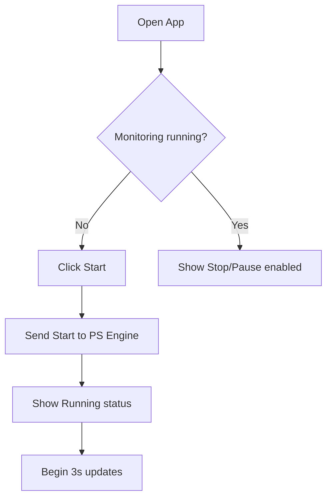
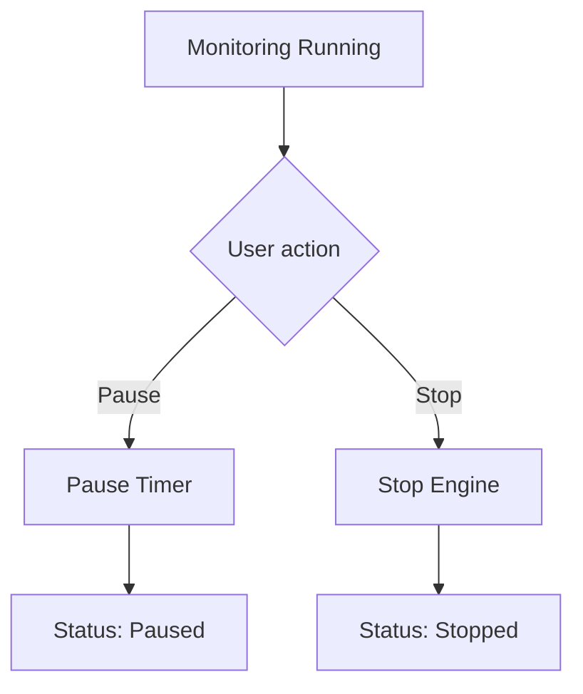
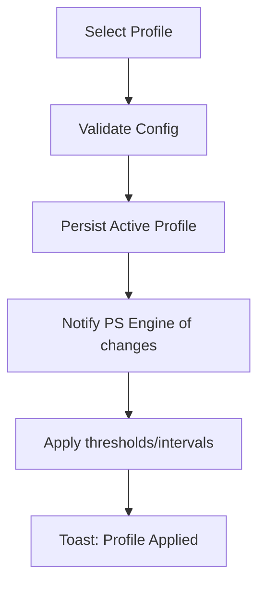
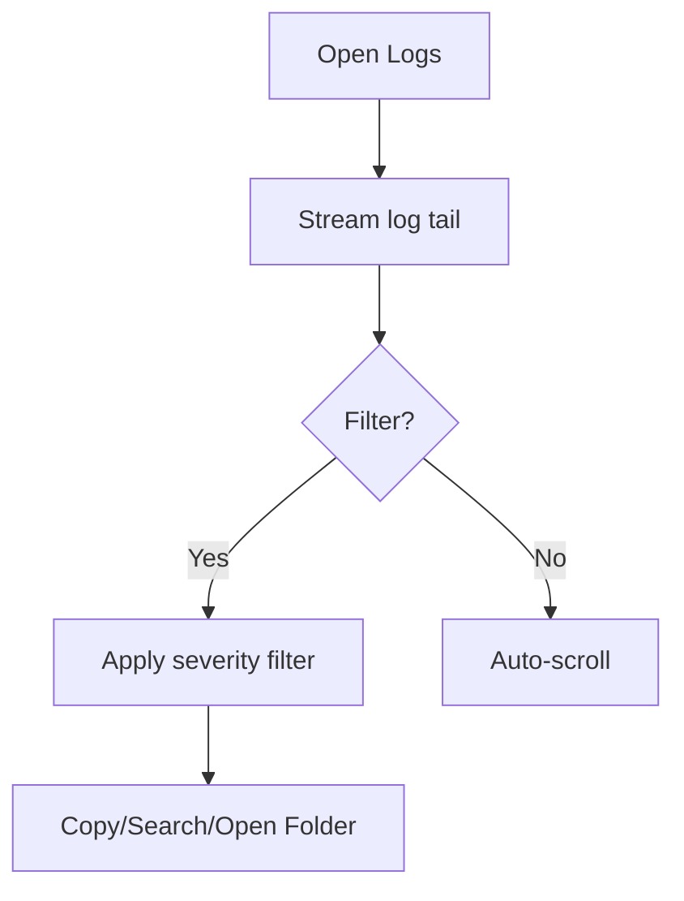
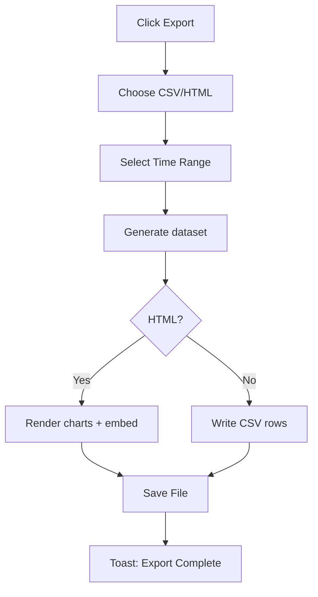
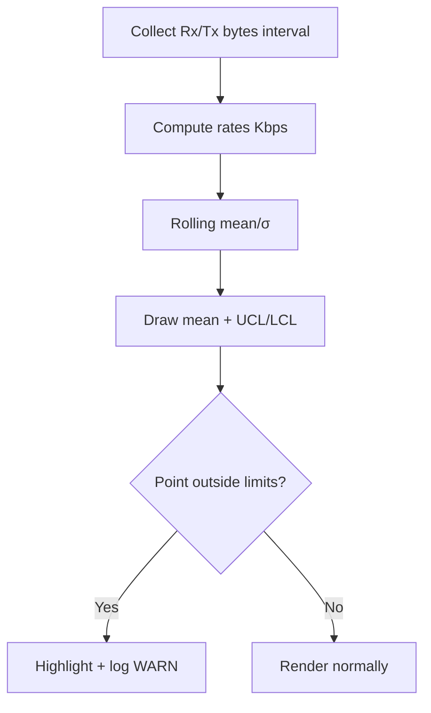

# Talo’s Internet Manager UI/UX Specification

## Introduction
This document defines the user experience goals, information architecture, user flows, and visual design specifications for Talo’s Internet Manager's user interface. It serves as the foundation for visual design and frontend development, ensuring a cohesive and user-centered experience.

### Overall UX Goals & Principles

#### Target User Personas
- The Frustrated Remote Worker: Needs a set-it-and-forget-it solution for stable video calls and daily work. Values simplicity and reliability.
- The Competitive Gamer: Wants minimal latency, jitter, and packet loss. Values real-time metrics and tuning options.
- The Tech-Savvy Tinkerer: Wants to understand, customize, and extend. Values detailed logs, advanced configuration, and open-source principles.

#### Usability Goals
- Onboarding inmediato: iniciar monitoreo en <30s tras instalar
- Comprensión instantánea: estado visible de un vistazo (color + texto)
- Confianza operacional: funciona en background con tray; UI silenciosa cuando todo va bien
- Acceso progresivo: controles avanzados sin intimidar a usuarios básicos
- Recuperación clara: mensajes y feedback claros durante y después de recovery

#### Design Principles
1. Status First: el estado actual manda (color + copy claro)
2. Quiet Confidence: discreta en normalidad, explícita en problemas
3. Progressive Disclosure: complejidad bajo demanda
4. Windows 11 Native: controles y patrones familiares
5. Real-time Feedback: actualizaciones fluidas y oportunas

### Change Log
| Date       | Version | Description                                                                     | Author |
| ---------- | ------- | ------------------------------------------------------------------------------- | ------ |
| 2025-10-02 | 0.1     | Initial draft (Intro, IA, initial flows)                                        | UX     |
| 2025-10-02 | 0.2     | Branding (Blue/White/Black), Light/Dark themes, responsiveness strategy, tokens | UX     |
| 2025-10-02 | 0.3     | Logs: Console "Detached" mode; Sampling 2 Hz; Internet activity in Kbps         | UX     |

---

## Information Architecture (IA)

### Site Map / Screen Inventory
```mermaid
graph TD
    A[System Tray Icon] -->|Double-click| B[Main Window - Dashboard]
    A -->|Right-click Menu| A1[Start/Stop/Exit]

    B --> C[Dashboard Tab]
    B --> D[Logs Tab]
    B --> E[Settings Tab]
    B --> F[About Tab]

    C --> C1[Status Indicator]
    C --> C2[Real-time Metrics Panel]
    C --> C3[Performance Charts]
    C --> C4[Control Bar]
  C --> C5[Traffic Activity Charts]
  C --> C6[Execution Console (Backtest) — Collapsible]

    C4 --> C4A[Start/Stop Button]
    C4 --> C4B[Pause Button]
    C4 --> C4C[Profile Selector]
    C4 --> C4D[Export Report]

    D --> D1[Log Viewer]
    D --> D2[Severity Filter]
    D --> D3[Search/Copy Actions]

    E --> E1[Profile Management]
    E --> E2[Advanced Settings]
    E --> E3[Theme Selector]
    E --> E4[Update Settings]

    E1 --> E1A[Home Profile]
    E1 --> E1B[Office Profile]
    E1 --> E1C[Gaming Profile]
    E1 --> E1D[Custom Profiles]

    E2 --> E2A[DNS Configuration]
    E2 --> E2B[Monitoring Aggressiveness]
    E2 --> E2C[Notification Settings]
    E2 --> E2D[Performance Thresholds]

    F --> F1[Version Info]
    F --> F2[Check for Updates]
    F --> F3[Documentation Links]
    F --> F4[Community/Support]
```

### Navigation Structure
**Primary Navigation:**
- Tab-based navigation (Dashboard, Logs, Settings, About)

**Secondary Navigation:**
- System Tray Menu: Connection status, Start/Stop, Open Dashboard, Exit, quick profile switch

**Breadcrumb Strategy:**
- No breadcrumbs (jerarquía plana; tabs de primer nivel)

---

## User Flows

> Note: Flows focus on P0 requirements first (FR-01 to FR-05) and map directly to PRD acceptance criteria.

### Flow: Start Monitoring from Main Window
**User Goal:** Begin monitoring quickly with current profile.

**Entry Points:** Main Window → Dashboard → Control Bar → Start

**Success Criteria:** Status changes to Running within 1s; metrics update ≤3s; tray reflects state.

#### Flow Diagram


#### Edge Cases & Error Handling
- Engine start fails → show toast + retry suggestion; log ERROR
- Missing admin rights → explain rationale + open Settings (read-only mode option)
- Conflicting instance detected → prompt to focus existing instance

#### Notes
- FR-01/FR-02/FR-03 alignment; NFR-01 responsiveness target applies

---

### Flow: Stop/Pause Monitoring
**User Goal:** Temporarily or fully halt monitoring.

**Entry Points:** Dashboard control bar; Tray menu

**Success Criteria:** Status becomes Stopped/Pause; no new tests; resume returns to previous cadence.

#### Flow Diagram


#### Edge Cases & Error Handling
- Pause pressed repeatedly → idempotent; visual feedback only
- Stop while recovery active → cancel safely, log reason
- Resume after long pause → clear stale metrics markers

#### Notes
- Pause optional (if not delivered in MVP, hide button)

---

### Flow: Switch Profile
**User Goal:** Change monitoring behavior to a different preset.

**Entry Points:** Dashboard selector; Settings → Profiles; Tray submenu

**Success Criteria:** New profile applies within 5s; confirmation toast; persists to %APPDATA%.

#### Flow Diagram


#### Edge Cases & Error Handling
- Invalid/corrupt profile → fallback to default; alert user
- Switching during test → queue apply after current cycle
- Headless profile switch via CLI → show tray balloon on success/fail

#### Notes
- FR-06/FR-07 acceptance alignment

---

### Flow: View Logs and Filter
**User Goal:** Inspect recent events and filter by severity.

**Entry Points:** Logs tab

**Success Criteria:** New entries stream live; filters apply instantly; copy and open-folder actions available.

#### Flow Diagram


#### Edge Cases & Error Handling
- Large log file → virtualized list; lazy tailing
- Filter = ERROR but none → empty state with hint
- File rotation → seamless switch to new file

#### Notes
- FR-05 and NFR-09 requirements

---

### Flow: Export Performance Report
**User Goal:** Export CSV/HTML with selected time range and summary stats.

**Entry Points:** Dashboard control bar → Export; Logs tab action

**Success Criteria:** File saved with correct metadata; HTML contains embedded charts; confirmation toast.

#### Flow Diagram


#### Edge Cases & Error Handling
- No data in range → disabled export with tooltip
- Disk write failure → retry prompt; suggest different folder
- HTML chart render timeout → fallback to simpler chart or CSV suggestion

#### Notes
- FR-09 alignment

---

### Flow: Toggle and Use Backtest Execution Console
**User Goal:** Ver en tiempo real lo que ejecuta el backend (acciones del engine/recovery/backtest) sin salir del Dashboard.

**Entry Points:** Dashboard → botón "Console" (dock lateral o cajón inferior); Logs tab → "Pin to Dashboard".

**Success Criteria:** Consola muestra streaming en ≤1s, filtro por categoría, auto-scroll configurable, sin afectar FPS de UI.

#### Flow Diagram
```mermaid
graph TD
  A[Dashboard] --> B{Console visible?}
  B -- No --> C[Open Console]
  C --> D[Start live tail (engine/backtest)]
  D --> E{Filter set?}
  E -- Yes --> F[Apply category filter]
  E -- No --> G[Show all with color-coded levels]
  F --> H[Auto-scroll ON]
  G --> H[Auto-scroll ON]
```

#### Edge Cases & Error Handling
- Buffer grande → limitar a N líneas (p.ej. 1000) con purga FIFO
- Auto-scroll OFF cuando el usuario se desplaza manualmente
- Pérdida de fuente de log → banner discreto y reconexión automática

#### Notes
- FR-05 ampliado al Dashboard; mejora observabilidad en tiempo real

---

### Flow: Analyze Internet Activity Control Charts (In/Out)
**User Goal:** Verificar actividad de red de entrada/salida (Mbps) con bandas de control (media, UCL, LCL) para detectar anomalías.

**Entry Points:** Dashboard → Traffic Activity Charts; botón Expand para detalle.

**Success Criteria:** Dos series (Download/Upload) en Kbps + líneas de media y bandas (±3σ) calculadas sobre ventana móvil; tooltips con valores; highlights cuando se exceden límites.

#### Flow Diagram


#### Edge Cases & Error Handling
- Ventana corta al inicio → ocultar bandas hasta N muestras mínimas
- Picos extremos → usar winsorization ligera opcional para bandas
- Tasa 0 sostenida → mostrar estado "Sin actividad" en subtítulo

#### Notes
- Requiere tasas Rx/Tx por intervalo desde backend (p.ej. Get-NetAdapterStatistics). NFR-03: mantener UI ≤16ms.

---

## Wireframes & Mockups

**Primary Design Files:** TBD (Figma/Sketch link)

### Key Screen Layouts

#### Screen: Main Window — Dashboard
**Purpose:** Provide at-a-glance connection health with real-time metrics and quick controls.

**Key Elements:**
- Connection Status Card (Optimal/Degraded/Offline with semantic color)
- Metrics Cards (Latency, Jitter, Packet Loss)
- Public IP + Active Adapter info
- Performance Charts (5-minute rolling, pause/expand)
- Traffic Activity Charts (Download/Upload en Kbps, control bands, expand)
- Control Bar (Start/Stop, Pause, Profile selector, Export)

**Interaction Notes:**
- Status and metrics update ≤3s; charts throttle to maintain UI responsiveness
- Buttons enable/disable based on state; Pause optional for MVP
- Expand chart opens a larger modal/pane without blocking updates
- Execution Console se presenta como panel lateral (Regular/Wide) o cajón inferior (Compact)

**Design File Reference:** TBD (Figma frame: Dashboard)

---

#### Screen: Logs Tab
**Purpose:** Inspect event history with live streaming and severity filtering.

**Key Elements:**
- Streaming log list (virtualized)
- Filters (All/INFO/WARN/ERROR) + search box
- Actions: Copy selection, Open log folder, Auto-scroll toggle

**Interaction Notes:**
- When filtering, auto-scroll pauses with clear affordance to resume
- Log rotation handled seamlessly; user remains at tail if auto-scroll enabled
 - Detached Console: toggle "Show Console" para dividir vista (lista de logs + consola) con filtros compartidos

**Design File Reference:** TBD (Figma frame: Logs)

---

#### Screen: Settings Tab
**Purpose:** Configure profiles, monitoring behavior, and advanced options.

**Key Elements:**
- Profiles: Home/Office/Gaming tiles + Create New
- Monitoring: Check interval slider (3/5/10s), thresholds, auto-start options
- Advanced: DNS configuration, notifications scope, theme (Light/Dark/System)

**Interaction Notes:**
- Changes autosave; invalid inputs show inline validation and helper text
- Some changes apply immediately; others queued until next cycle

**Design File Reference:** TBD (Figma frame: Settings)

---

#### Screen: About Tab
**Purpose:** Show version, update check, documentation/support links.

**Key Elements:**
- Version and channel
- Check for updates button
- Links: Wiki, Troubleshooting, Community

**Interaction Notes:**
- Update status communicates result with toast and inline message

**Design File Reference:** TBD (Figma frame: About)

---

#### Surface: System Tray Menu
**Purpose:** Provide quick status and essential controls without opening the app.

**Key Elements:**
- Status summary (latency, loss)
- Start/Stop actions (contextual)
- Profile quick switch submenu
- Open Dashboard, Settings, Exit

**Interaction Notes:**
- Menu reflects current state and disables irrelevant actions

**Design File Reference:** TBD (Figma frame: Tray)

---

#### Surface: Toast Notification — Connection Restored
**Purpose:** Notify user of important state changes with quick deep link.

**Key Elements:**
- Title + message with key metrics
- Action: View Dashboard (deep link)

**Interaction Notes:**
- Respects Focus Assist; collapses to notification center if suppressed

**Design File Reference:** TBD (Figma frame: Toast)

---

#### State: Connection Degraded / Recovery in Progress
**Purpose:** Communicate ongoing recovery steps and expected behavior.

**Key Elements:**
- Status card in yellow with recovery stepper (e.g., DNS check → Adapter refresh → Route update → Reset)
- Metrics placeholders showing testing/in-progress

**Interaction Notes:**
- Stepper updates in real time; logs tab highlights related entries

**Design File Reference:** TBD (Figma frame: Degraded)

---

#### Surface: Execution Console (Docked/Drawer)
**Purpose:** Mostrar ejecución del backend en tiempo real anclado al Dashboard.

**Key Elements:**
- Stream de líneas con timestamp, nivel (INFO/WARN/ERROR), categoría (Engine/Recovery/Backtest)
- Filtros, búsqueda, auto-scroll toggle, Copy/Save buffer
- Botón "Pin/Unpin" al Dashboard (y acceso desde Logs)

**Interaction Notes:**
- Auto-pausa auto-scroll cuando el usuario se desplaza; retoma con botón
- Buffer configurable (p.ej., 500–5000 líneas) para rendimiento

**Design File Reference:** TBD (Figma frame: Console)

---

#### Charts: Traffic Activity with Control Bands
**Purpose:** Visualizar tasas de entrada/salida (Mbps) con bandas de control SPC.

**Key Elements:**
- Series: Download y Upload (líneas/áreas)
- Mean line (μ) y bandas UCL/LCL (μ ± 3σ)
- Tooltips con timestamp, tasas y distancia a límites

**Interaction Notes:**
- Mostrar bandas solo con suficientes muestras; opción de suavizado
- Resaltar puntos fuera de control y generar entrada WARN en Logs

**Design File Reference:** TBD (Figma frame: Traffic Charts)

---

## Component Library / Design System

**Design System Approach:** Adopt Material Design in XAML Toolkit as the primary component library for WPF while aligning visual styling and behavior with Windows 11 Fluent design conventions (e.g., corner radius, subtle elevation, reveal focus). Use theme resources (Light/Dark/System) and design tokens (colors, typography, spacing) centralized in ResourceDictionaries. Charts use LiveCharts2 with a simplified theme matching app tokens.

### Core Components

#### Component: StatusCard
**Purpose:** Communicate current connection status at a glance.

**Variants:** Optimal (Green), Degraded (Amber), Offline/Critical (Red)

**States:** Loading, Idle, Updating, Recovering

**Usage Guidelines:** Always placed at top of Dashboard; include semantic color bar, concise status text, subtext with last check time and active profile. Announce changes via live region for screen readers.

---

#### Component: MetricCard
**Purpose:** Display a single key metric (Latency, Jitter, Packet Loss) with qualitative label.

**Variants:** Latency | Jitter | Packet Loss

**States:** Normal, Attention, Critical, NoData

**Usage Guidelines:** Show numeric value + unit prominently; include small trend arrow when available. Use thresholds from active profile to determine color/state. Provide tooltip with last 5-min avg/min/max.

---

#### Component: ChartsPanel
**Purpose:** Visualize rolling 5-minute history for key metrics.

**Variants:** Combined (overlay) | Split (stacked)

**States:** Streaming, Paused, Expanded, Empty

**Usage Guidelines:** Default to throttled streaming to protect UI thread. Offer pause/resume and expand controls. Tooltip shows timestamp + values. Maintain 100+ samples with decimation for performance (NFR-03).

---

#### Component: TrafficControlChart
**Purpose:** Mostrar Download/Upload con bandas de control (mean ± 3σ) en una ventana móvil.

**Variants:** Overlay (ambas series en una) | Split (dos subcharts)

**States:** WarmingUp (sin bandas), InControl, OutOfControl (puntos resaltados)

**Usage Guidelines:** Requiere entrada de tasas por intervalo en Kbps; calcular μ y σ en el cliente o provistas por backend. Permitir toggles para Mean/UCL/LCL. Mantener performance con muestreo a 2 Hz y decimación.

---

#### Component: ExecutionConsole
**Purpose:** Consola de ejecución en tiempo real (engine/recovery/backtest) anclada al Dashboard.

**Variants:** Docked Side Panel | Bottom Drawer | Detached (Logs Tab)

**States:** Live (auto-scroll), Paused, Filtered, BufferFull

**Usage Guidelines:** Mostrar columnas (hora, nivel, categoría, mensaje). Colorear por nivel. Evitar bloquear UI: usar virtualización y batch append. Permitirá Copiar/Guardar buffer. En la pestaña Logs, el modo por defecto puede ser "Detached" con división vertical.

---

#### Component: ControlBandLegend
**Purpose:** Leyenda compacta para μ, UCL, LCL y series In/Out.

**Variants:** Compact | Expanded

**States:** Mean/limits toggled on/off

**Usage Guidelines:** Mostrar colores consistentes; tooltips con fórmulas y valores actuales.

---
#### Component: ControlBar
**Purpose:** Primary actions and quick selectors for monitoring.

**Variants:** Running | Paused | Stopped

**States:** Buttons enabled/disabled by state; Export disabled when no data

**Usage Guidelines:** Order: Start/Stop, Pause, Profile selector, Export. Provide keyboard shortcuts: Ctrl+R (Start/Stop), Ctrl+P (Pause), Ctrl+E (Export). Announce state changes.

---

#### Component: ProfileTile
**Purpose:** Represent a profile preset for quick selection.

**Variants:** Home | Office | Gaming | Custom

**States:** Selected, Unselected, Disabled (invalid)

**Usage Guidelines:** Tile shows name + short descriptor. Right-click or context action opens Edit/Delete. Creating a new profile launches a guided modal with validation.

---

#### Component: LogList
**Purpose:** Stream and view events efficiently.

**Variants:** Dense | Comfortable

**States:** Live (auto-scroll), Paused, Filtered, Empty

**Usage Guidelines:** Virtualized list with sticky time/level columns. Provide copy and open-folder actions. Preserve scroll position when filtering; show empty state message when no matches.

---

#### Component: SeverityFilter
**Purpose:** Toggle visible log levels.

**Variants:** All | INFO | WARN | ERROR

**States:** Selected, Unselected, Disabled

**Usage Guidelines:** Mutually exclusive selection with clear affordance. Reflect selection in aria-pressed for accessibility.

---

#### Component: SettingsGroup
**Purpose:** Group related settings with clear headings and help text.

**Variants:** Profiles | Monitoring | Advanced | Updates | Theme

**States:** Valid, Invalid (with inline error), Pending Apply

**Usage Guidelines:** Each control includes label, helper text, and validation message. Autosave pattern with subtle confirmation. Dangerous actions require confirmation.

---

#### Component: ToastNotification
**Purpose:** Inform critical events (disconnect/reconnect, recovery escalations).

**Variants:** Success | Warning | Error | Info

**States:** Queued, Displayed, Dismissed

**Usage Guidelines:** Short copy with key metric(s). Include deep link to Dashboard. Respect Focus Assist; send to Notification Center when suppressed.

---

#### Component: TrayMenu
**Purpose:** Quick access to status and controls from system tray.

**Variants:** Running | Paused | Stopped

**States:** Items enabled/disabled contextually

**Usage Guidelines:** Top section shows status summary; actions follow. Profile submenu lists presets with current indicated. Ensure accelerator keys for keyboard access.

---

## Branding & Style Guide

**Brand Identity:** Talo’s Internet Manager — Minimalista, confiable, moderno. Paleta basada en Azul/Blanco/Negro. Variantes Light/Dark.

### Color Palette

Semantic mapping ensures clarity for network statuses while staying within blue/white/black preferences.

Light Theme:
- Primary Blue: #1E40AF (Blue 800)
- Primary Blue Hover: #1D4ED8 (Blue 700)
- Background: #FFFFFF
- Surface: #F8FAFC (Slate 50)
- Text Primary: #0B0B0C (Near-Black)
- Text Secondary: #4B5563 (Slate 600)
- Border/Subtle: #E5E7EB (Gray 200)
- Success: #16A34A
- Warning: #F59E0B
- Error: #DC2626

Dark Theme:
- Primary Blue: #60A5FA (Blue 300)
- Primary Blue Hover: #3B82F6 (Blue 400)
- Background: #0B0B0C (Near-Black)
- Surface: #111827 (Gray 900)
- Text Primary: #F3F4F6
- Text Secondary: #9CA3AF
- Border/Subtle: #374151
- Success: #22C55E
- Warning: #FBBF24
- Error: #F87171

Status Colors (shared):
- Optimal: #16A34A (Green 600)
- Degraded: #F59E0B (Amber 500)
- Critical/Offline: #DC2626 (Red 600)

Notes: Blues selected for readability on both themes; whites and blacks tuned for contrast. Status colors align with network semantics.

### Typography
- Primary: Segoe UI Variable (Windows 11)
- Secondary: Inter (fallback)
- Monospace: Cascadia Code (logs/IP)

Type Scale:
- H1: 24px, 600, 32px LH
- H2: 20px, 600, 28px LH
- H3: 16px, 600, 24px LH
- Body: 14px, 400, 20px LH
- Small: 12px, 400, 16px LH

### Iconography
- Fluent System Icons (Regular/Filled)
- Use filled for state, regular for actions; keep semantic meaning consistent

### Spacing & Layout
- Grid: 8px base (with 4px fine-tune)
- Spacing scale: 4, 8, 12, 16, 24, 32
- Corner radius: 8px (4px for compact controls)
- Elevation: minimal; prefer 1px borders; shadows only for overlays/menus

---

## Accessibility Requirements

**Compliance Target:** WCAG 2.1 AA

Key Requirements:
- Visual: Contrast ≥ 4.5:1 (text normal), ≥ 3:1 (UI large); visible focus; scalable text up to 150%
- Interaction: Full navegación por teclado; roles/labels de controles; lectura de estado en vivo (status + toasts)
- Content: Alt text en iconos informativos; estructura de headings clara; labels de formulario vinculados

Testing Strategy: Narrator + Accessibility Insights; contrast checks en Light/Dark; atajos de teclado documentados.

---

## Responsiveness & Adaptive Layout

Talo’s Internet Manager debe verse bien en diferentes dimensiones de ventana (redimensionable en desktop). No es móvil, pero soporta tamaños compactos y anchos grandes.

Breakpoints (aproximados):
- Compact: ≤ 960px ancho — layout de 1 columna; charts en pestaña/colapsables
- Regular: 961–1440px — layout de 2 columnas; charts visibles
- Wide: > 1440px — layout de 3 columnas o panel lateral extra (detalle logs)

Adaptation Patterns:
- Layout Changes: Cards refluye de 1→2→3 columnas; Control Bar se comprime en overflow menu en Compact
- Navigation Changes: Tabs siempre visibles; en Compact, títulos más cortos, ocultar subtítulos
- Content Priority: StatusCard siempre visible; métricas clave antes que charts; logs en segunda pestaña
- Interaction Changes: Hit targets ≥ 40px; tooltips reemplazan texto secundario en Compact

Execution Console Adaptation:
- Compact: Cajón inferior sobre el Dashboard con altura ajustable
- Regular/Wide: Panel lateral docked a la derecha; ancho configurable

Traffic Charts Adaptation:
- Compact: Vista Split con tabs (Download | Upload); bandas ocultas hasta suficientes muestras
- Wide: Overlay con bandas y leyenda expandida

Performance Considerations:
- Throttle updates y decimación de datos de charts (2 Hz de muestreo) para ≤16ms frame en UI thread
- Virtualización en listas (logs) y diferir render de tabs no activas
 - Buffer de consola con límites y append por lotes; evitar layouts costosos por línea

---

## Monitoring Defaults & Data Contracts

Defaults
- Sampling Frequency: 2 Hz (lecturas y actualización de charts cada 500 ms)
- Internet Activity Unit: Kbps (kilobits por segundo)
- Control Window: 120 muestras (~60 s @ 2 Hz) para media y σ de bandas de control

Data Contracts
- ExecutionConsoleLine
  - timestamp: DateTime
  - level: "INFO" | "WARN" | "ERROR"
  - category: "Engine" | "Recovery" | "Backtest"
  - message: string
  - source: string (opcional)

- TrafficSample
  - timestamp: DateTime
  - rxKbps: double
  - txKbps: double
  - windowMeanRx: double (opcional)
  - windowStdRx: double (opcional)
  - windowMeanTx: double (opcional)
  - windowStdTx: double (opcional)

Notes
- Conversión: Kbps = (Δbytes × 8) / Δt / 1000
- Bandas: UCL/LCL = μ ± 3σ; ocultar hasta alcanzar N mínimo (p.ej., 30 muestras)

---

## Design Tokens (XAML Examples)

```xml
<!-- Colors.xaml -->
<ResourceDictionary xmlns="http://schemas.microsoft.com/winfx/2006/xaml/presentation"
                    xmlns:x="http://schemas.microsoft.com/winfx/2006/xaml">
  <!-- Light Theme -->
  <Color x:Key="Color.Primary">#FF1E40AF</Color>
  <Color x:Key="Color.Primary.Hover">#FF1D4ED8</Color>
  <Color x:Key="Color.Background">#FFFFFFFF</Color>
  <Color x:Key="Color.Surface">#FFF8FAFC</Color>
  <Color x:Key="Color.Text">#FF0B0B0C</Color>
  <Color x:Key="Color.Text.Secondary">#FF4B5563</Color>
  <Color x:Key="Color.Border">#FFE5E7EB</Color>
  <Color x:Key="Color.Success">#FF16A34A</Color>
  <Color x:Key="Color.Warning">#FFF59E0B</Color>
  <Color x:Key="Color.Error">#FFDC2626</Color>

  <!-- Dark Theme -->
  <Color x:Key="Dark.Color.Primary">#FF60A5FA</Color>
  <Color x:Key="Dark.Color.Primary.Hover">#FF3B82F6</Color>
  <Color x:Key="Dark.Color.Background">#FF0B0B0C</Color>
  <Color x:Key="Dark.Color.Surface">#FF111827</Color>
  <Color x:Key="Dark.Color.Text">#FFF3F4F6</Color>
  <Color x:Key="Dark.Color.Text.Secondary">#FF9CA3AF</Color>
  <Color x:Key="Dark.Color.Border">#FF374151</Color>
  <Color x:Key="Dark.Color.Success">#FF22C55E</Color>
  <Color x:Key="Dark.Color.Warning">#FFFBBF24</Color>
  <Color x:Key="Dark.Color.Error">#FFF87171</Color>

  <!-- Brushes -->
  <SolidColorBrush x:Key="Brush.Primary" Color="{StaticResource Color.Primary}"/>
  <SolidColorBrush x:Key="Brush.Text" Color="{StaticResource Color.Text}"/>
  <SolidColorBrush x:Key="Brush.Surface" Color="{StaticResource Color.Surface}"/>
  <SolidColorBrush x:Key="Brush.Border" Color="{StaticResource Color.Border}"/>

  <!-- Status -->
  <SolidColorBrush x:Key="Brush.Status.Optimal" Color="#FF16A34A"/>
  <SolidColorBrush x:Key="Brush.Status.Degraded" Color="#FFF59E0B"/>
  <SolidColorBrush x:Key="Brush.Status.Critical" Color="#FFDC2626"/>
</ResourceDictionary>
```

```xml
<!-- Typography.xaml -->
<ResourceDictionary xmlns="http://schemas.microsoft.com/winfx/2006/xaml/presentation"
                    xmlns:x="http://schemas.microsoft.com/winfx/2006/xaml">
  <FontFamily x:Key="Font.Primary">Segoe UI Variable</FontFamily>
  <FontFamily x:Key="Font.Mono">Cascadia Code</FontFamily>

  <Style x:Key="Text.H1" TargetType="TextBlock">
    <Setter Property="FontFamily" Value="{StaticResource Font.Primary}"/>
    <Setter Property="FontSize" Value="24"/>
    <Setter Property="FontWeight" Value="SemiBold"/>
    <Setter Property="Foreground" Value="{StaticResource Brush.Text}"/>
  </Style>
  <Style x:Key="Text.Body" TargetType="TextBlock">
    <Setter Property="FontFamily" Value="{StaticResource Font.Primary}"/>
    <Setter Property="FontSize" Value="14"/>
    <Setter Property="Foreground" Value="{StaticResource Brush.Text}"/>
  </Style>
</ResourceDictionary>
```

Implementation Notes:
- Cargar diccionarios por tema (Light/Dark) y conmutar dinámicamente; seguir NFR-04/NFR-05.
- Unificar tokens para Material Design in XAML y LiveCharts2 via Theme dictionaries.
