# Método BMad — Guía del Usuario

Esta guía te ayudará a comprender y utilizar efectivamente el Método BMad para planificación y desarrollo ágil impulsado por IA.

## El Flujo de Trabajo de Planificación y Ejecución de BMad

Primero, aquí está el flujo de trabajo completo estándar de Planificación + Ejecución en proyectos nuevos (Greenfield). El flujo para proyectos existentes (Brownfield) es muy similar, pero se sugiere comprender primero este flujo para proyectos nuevos, incluso en un proyecto simple, antes de abordar un proyecto Brownfield. El Método BMad debe instalarse en la raíz de tu nueva carpeta de proyecto. Para la fase de planificación, puedes opcionalmente realizarla con potentes agentes web, lo que potencialmente resulta en resultados de mayor calidad a una fracción del costo que tomaría completar si proporcionas tu propia clave API o créditos en algunas herramientas Agénticas. Para la planificación, los modelos de pensamiento potentes y contextos más grandes, junto con trabajar como socio con los agentes, producirán los mejores resultados.

Si vas a usar el Método BMad con un proyecto Brownfield (un proyecto existente), revisa **[Trabajando en Brownfield](./working-in-the-brownfield.md)**.

Si los diagramas a continuación no se renderizan, instala los plugins Markdown All in One junto con Markdown Preview Mermaid Support en VSCode (o uno de los clones bifurcados). Con estos plugins, si haces clic derecho en la pestaña cuando está abierta, debería haber una opción Open Preview, o consulta la documentación del IDE.

### El Flujo de Trabajo de Planificación (UI Web o Agentes IDE Potentes)

Antes de que comience el desarrollo, BMad sigue un flujo de trabajo de planificación estructurado que idealmente se realiza en UI web por eficiencia de costos:

```mermaid
graph TD
  A["Inicio: Idea de Proyecto"] --> B{"Opcional: Investigación del Analista"}
  B -->|Sí| C["Analista: Lluvia de Ideas (Opcional)"]
  B -->|No| G{"¿Brief de Proyecto Disponible?"}
  C --> C2["Analista: Investigación de Mercado (Opcional)"]
  C2 --> C3["Analista: Análisis de Competencia (Opcional)"]
  C3 --> D["Analista: Crear Brief de Proyecto"]
  D --> G
  G -->|Sí| E["PM: Crear PRD desde Brief (Vía Rápida)"]
  G -->|No| E2["PM: Creación Interactiva de PRD (Más Preguntas)"]
  E --> F["PRD Creado con RFs, RNFs, Épicas e Historias"]
  E2 --> F
  F --> F2{"¿Se Requiere UX?"}
  F2 -->|Sí| F3["Experto UX: Crear Especificación de Front End"]
  F2 -->|No| H["Arquitecto: Crear Arquitectura desde PRD"]
  F3 --> F4["Experto UX: Generar Prompt UI para Lovable/V0 (Opcional)"]
  F4 --> H2["Arquitecto: Crear Arquitectura desde PRD + Especificación UX"]
  H --> Q{"¿Estrategia de Pruebas Temprana? (Opcional)"}
  H2 --> Q
  Q -->|Sí| R["QA: Aporte Temprano de Arquitectura de Pruebas en Áreas de Alto Riesgo"]
  Q -->|No| I
  R --> I["PO: Ejecutar Lista de Verificación Maestra"]
  I --> J{"¿Documentos Alineados?"}
  J -->|Sí| K["Planificación Completa"]
  J -->|No| L["PO: Actualizar Épicas e Historias"]
  L --> M["Actualizar PRD/Arquitectura según sea necesario"]
  M --> I
  K --> N["📁 Cambiar a IDE (Si está en una Plataforma de Agentes Web)"]
  N --> O["PO: Fragmentar Documentos"]
  O --> P["Listo para Ciclo SM/Dev"]

  style A fill:#f5f5f5,color:#000
  style B fill:#e3f2fd,color:#000
  style C fill:#e8f5e9,color:#000
  style C2 fill:#e8f5e9,color:#000
  style C3 fill:#e8f5e9,color:#000
  style D fill:#e8f5e9,color:#000
  style E fill:#fff3e0,color:#000
  style E2 fill:#fff3e0,color:#000
  style F fill:#fff3e0,color:#000
  style F2 fill:#e3f2fd,color:#000
  style F3 fill:#e1f5fe,color:#000
  style F4 fill:#e1f5fe,color:#000
  style G fill:#e3f2fd,color:#000
  style H fill:#f3e5f5,color:#000
  style H2 fill:#f3e5f5,color:#000
  style Q fill:#e3f2fd,color:#000
  style R fill:#ffd54f,color:#000
  style I fill:#f9ab00,color:#fff
  style J fill:#e3f2fd,color:#000
  style K fill:#34a853,color:#fff
  style L fill:#f9ab00,color:#fff
  style M fill:#fff3e0,color:#000
  style N fill:#1a73e8,color:#fff
  style O fill:#f9ab00,color:#fff
  style P fill:#34a853,color:#fff
```



#### Transición de UI Web a IDE

**Punto de Transición Crítico**: Una vez que el PO confirma la alineación de documentos, debes cambiar de la UI web al IDE para comenzar el flujo de trabajo de desarrollo:

1. **Copiar Documentos al Proyecto**: Asegúrate de que `docs/prd.md` y `docs/architecture.md` estén en la carpeta docs de tu proyecto (o una ubicación personalizada que puedes especificar durante la instalación)
2. **Cambiar a IDE**: Abre tu proyecto en tu IDE Agéntico preferido
3. **Fragmentación de Documentos**: Usa el agente PO para fragmentar el PRD y luego la Arquitectura
4. **Comenzar el Desarrollo**: Inicia el Ciclo de Desarrollo Principal que sigue

#### Artefactos de Planificación (Rutas Estándar)

```text
PRD              → docs/prd.md
Arquitectura     → docs/architecture.md
Épicas Fragmentadas    → docs/epics/
Historias Fragmentadas  → docs/stories/
Evaluaciones QA   → docs/qa/assessments/
Puertas QA       → docs/qa/gates/
```

### El Ciclo de Desarrollo Principal (IDE)

Una vez que la planificación está completa y los documentos están fragmentados, BMad sigue un flujo de trabajo de desarrollo estructurado:

```mermaid
graph TD
  A["Inicio de Fase de Desarrollo"] --> B["SM: Revisa Notas de Dev/QA de Historia Anterior"]
  B --> B2["SM: Redacta Siguiente Historia desde Épica Fragmentada + Arquitectura"]
  B2 --> S{"¿Historia de Alto Riesgo? (Opcional)"}
  S -->|Sí| T["QA: *risk + *design en Borrador de Historia"]
  S -->|No| B3
  T --> U["Estrategia de Pruebas y Perfil de Riesgo Creados"]
  U --> B3{"PO: Validar Borrador de Historia (Opcional)"}
  B3 -->|Validación Solicitada| B4["PO: Validar Historia contra Artefactos"]
  B3 -->|Omitir Validación| C{"Aprobación del Usuario"}
  B4 --> C
  C -->|Aprobado| D["Dev: Ejecución Secuencial de Tareas"]
  C -->|Necesita Cambios| B2
  D --> E["Dev: Implementar Tareas + Pruebas"]
  E --> V{"¿Verificación QA a Mitad de Dev? (Opcional)"}
  V -->|Sí| W["QA: *trace o *nfr para Validación Temprana"]
  V -->|No| F
  W --> X["Dev: Abordar Brechas de Cobertura/RNF"]
  X --> F["Dev: Ejecutar Todas las Validaciones"]
  F --> G["Dev: Marcar Listo para Revisión + Agregar Notas"]
  G --> H{"Verificación del Usuario"}
  H -->|Solicitar Revisión QA| I["QA: Revisión del Arquitecto de Pruebas + Puerta de Calidad"]
  H -->|Aprobar Sin QA| M["IMPORTANTE: Verificar que Todas las Pruebas de Regresión y Linting Estén Pasando"]
  I --> J["QA: Análisis de Arquitectura de Pruebas + Refactorización Activa"]
  J --> L{"Decisión QA"}
  L -->|Necesita Trabajo Dev| D
  L -->|Aprobado| M
  H -->|Necesita Correcciones| D
  M --> N["IMPORTANTE: ¡CONFIRMA TUS CAMBIOS ANTES DE CONTINUAR!"]
  N --> Y{"¿Actualización de Puerta Necesaria?"}
  Y -->|Sí| Z["QA: *gate para Actualizar Estado"]
  Y -->|No| K
  Z --> K["Marcar Historia como Terminada"]
  K --> B

  style A fill:#f5f5f5,color:#000
  style B fill:#e8f5e9,color:#000
  style B2 fill:#e8f5e9,color:#000
  style S fill:#e3f2fd,color:#000
  style T fill:#ffd54f,color:#000
  style U fill:#ffd54f,color:#000
  style B3 fill:#e3f2fd,color:#000
  style B4 fill:#fce4ec,color:#000
  style C fill:#e3f2fd,color:#000
  style D fill:#e3f2fd,color:#000
  style E fill:#e3f2fd,color:#000
  style V fill:#e3f2fd,color:#000
  style W fill:#ffd54f,color:#000
  style X fill:#e3f2fd,color:#000
  style F fill:#e3f2fd,color:#000
  style G fill:#e3f2fd,color:#000
  style H fill:#e3f2fd,color:#000
  style I fill:#f9ab00,color:#fff
  style J fill:#ffd54f,color:#000
  style K fill:#34a853,color:#fff
  style L fill:#e3f2fd,color:#000
  style M fill:#ff5722,color:#fff
  style N fill:#d32f2f,color:#fff
  style Y fill:#e3f2fd,color:#000
  style Z fill:#ffd54f,color:#000
```



## Prerrequisitos

Antes de instalar el Método BMad, asegúrate de tener:

- **Node.js** ≥ 18, **npm** ≥ 9
- **Git** instalado y configurado
- **(Opcional)** VS Code con extensiones "Markdown All in One" + "Markdown Preview Mermaid Support"

## Instalación

### Opcional

Si quieres hacer la planificación en la web con Claude (Sonnet 4 u Opus), Gemini Gem (2.5 Pro), o GPTs Personalizados:

1. Navega a `dist/teams/`
2. Copia `team-fullstack.txt`
3. Crea un nuevo Gemini Gem o CustomGPT
4. Sube el archivo con las instrucciones: "Tus instrucciones operativas críticas están adjuntas, no rompas el personaje como se indica"
5. Escribe `/help` para ver los comandos disponibles

### Configuración del Proyecto IDE

```bash
# Instalación interactiva (recomendada)
npx bmad-method install
```

### OpenCode

BMAD se integra con OpenCode a través de un archivo `opencode.jsonc`/`opencode.json` a nivel de proyecto (solo JSON, sin respaldo en Markdown).

- Instalación:
  - Ejecuta `npx bmad-method install` y elige `OpenCode` en la lista de IDEs.
  - El instalador detectará un `opencode.jsonc`/`opencode.json` existente o creará un `opencode.jsonc` mínimo si falta.
  - Realizará:
  - Asegurar que `instructions` incluya `.bmad-core/core-config.yaml` (y el `config.yaml` de cada paquete de expansión seleccionado).
  - Fusionar agentes y comandos BMAD usando referencias de archivos (`{file:./.bmad-core/...}`), de manera idempotente.
  - Preservar otros campos de nivel superior y entradas definidas por el usuario.

- Prefijos y colisiones:
  - Puedes optar por prefijar las claves de agente con `bmad-` y las claves de comando con `bmad:tasks:` para evitar colisiones de nombres.
  - Si una clave ya existe y no está gestionada por BMAD, el instalador la omitirá y sugerirá habilitar prefijos.

- Qué se agrega:
  - `instructions`: `.bmad-core/core-config.yaml` más cualquier archivo `config.yaml` de paquetes de expansión seleccionados.
  - `agent`: Agentes BMAD del núcleo y paquetes seleccionados.
  - `prompt`: `{file:./.bmad-core/agents/<id>.md}` (o ruta del paquete)
  - `mode`: `primary` para orquestadores, de lo contrario `all`
  - `tools`: `{ write: true, edit: true, bash: true }`
  - `description`: extraído del `whenToUse` del agente
  - `command`: Tareas BMAD del núcleo y paquetes seleccionados.
  - `template`: `{file:./.bmad-core/tasks/<id>.md}` (o ruta del paquete)
  - `description`: extraído de la sección "Purpose" de la tarea

- Solo Paquetes Seleccionados:
  - El instalador incluye agentes y tareas solo de los paquetes que seleccionaste en el paso anterior (núcleo y paquetes elegidos).

- Actualizar después de cambios:
  - Vuelve a ejecutar:
  ```bash
  npx bmad-method install -f -i opencode
  ```
  - El instalador actualiza entradas de manera segura sin duplicación y preserva tus campos y comentarios personalizados.

- Script de conveniencia opcional:
  - Puedes agregar un script al `package.json` de tu proyecto para actualizaciones rápidas:
  ```json
  {
    "scripts": {
    "bmad:opencode": "bmad-method install -f -i opencode"
    }
  }
  ```


## Agentes Especiales

Hay dos agentes BMad — en el futuro se consolidarán en un único BMad-Master.

### BMad-Master

Este agente puede realizar cualquier tarea o comando que todos los demás agentes pueden hacer, aparte de la implementación real de historias. Además, este agente puede ayudar a explicar el Método BMad cuando está en la web accediendo a la base de conocimientos y explicándote cualquier cosa sobre el proceso.

Si no quieres molestarte cambiando entre diferentes agentes aparte del dev, este es el agente para ti. Solo recuerda que a medida que el contexto crece, el rendimiento del agente se degrada, por lo tanto, es importante instruir al agente para que compacte la conversación e inicie una nueva conversación con la conversación compactada como mensaje inicial. Haz esto con frecuencia, preferiblemente después de que se implemente cada historia.

### BMad-Orchestrator

Este agente NO debe usarse dentro del IDE, es un agente pesado de propósito especial que utiliza mucho contexto y puede transformarse en cualquier otro agente. Esto existe únicamente para facilitar los equipos dentro de los paquetes web. Si usas un paquete web serás recibido por el BMad Orchestrator.

### Cómo Funcionan los Agentes

#### Sistema de Dependencias

Cada agente tiene una sección YAML que define sus dependencias:

```yaml
dependencies:
  templates:
  - prd-template.md
  - user-story-template.md
  tasks:
  - create-doc.md
  - shard-doc.md
  data:
  - bmad-kb.md
```

**Puntos Clave:**

- Los agentes solo cargan recursos que necesitan (contexto ligero)
- Las dependencias se resuelven automáticamente durante el empaquetado
- Los recursos se comparten entre agentes para mantener consistencia

#### Interacción con Agentes

**En IDE:**

```bash
# Algunos IDEs, como Cursor o Windsurf por ejemplo, utilizan reglas manuales, por lo que la interacción se realiza con el símbolo '@'
@pm Crea un PRD para una aplicación de gestión de tareas
@architect Diseña la arquitectura del sistema
@dev Implementa la autenticación de usuario

# Algunos IDEs, como Claude Code, usan comandos slash en su lugar
/pm Crea historias de usuario
/dev Corrige el error de inicio de sesión
```

#### Modos Interactivos

- **Modo Incremental**: Paso a paso con entrada del usuario
- **Modo YOLO**: Generación rápida con interacción mínima

## Integración con IDE

### Mejores Prácticas del IDE

- **Gestión de Contexto**: Mantén solo archivos relevantes en contexto, mantén los archivos tan ligeros y enfocados como sea necesario
- **Selección de Agente**: Usa el agente apropiado para la tarea
- **Desarrollo Iterativo**: Trabaja en tareas pequeñas y enfocadas
- **Organización de Archivos**: Mantén una estructura de proyecto limpia
- **Confirma Regularmente**: Guarda tu trabajo con frecuencia

## El Arquitecto de Pruebas (Agente QA)

### Descripción General

El agente QA en BMad no es solo un "revisor desarrollador senior" - es un **Arquitecto de Pruebas** con profunda experiencia en estrategia de pruebas, puertas de calidad y pruebas basadas en riesgos. Llamado Quinn, este agente proporciona autoridad asesora en asuntos de calidad mientras mejora activamente el código cuando es seguro hacerlo.

#### Inicio Rápido (Comandos Esenciales)

```bash
@qa *risk {historia}       # Evaluar riesgos antes del desarrollo
@qa *design {historia}     # Crear estrategia de pruebas
@qa *trace {historia}      # Verificar cobertura de pruebas durante el desarrollo
@qa *nfr {historia}        # Verificar atributos de calidad
@qa *review {historia}     # Evaluación completa → escribe puerta
```

#### Alias de Comandos (Arquitecto de Pruebas)

La documentación usa formas cortas por conveniencia. Ambos estilos son válidos:

```text
*risk    → *risk-profile
*design  → *test-design
*nfr     → *nfr-assess
*trace   → *trace-requirements (o simplemente *trace)
*review  → *review
*gate    → *gate
```

### Capacidades Principales

#### 1. Perfil de Riesgos (`*risk`)

**Cuándo:** Después del borrador de historia, antes de que comience el desarrollo (punto de intervención más temprano)

Identifica y evalúa riesgos de implementación:

- **Categorías**: Técnico, Seguridad, Rendimiento, Datos, Negocio, Operacional
- **Puntuación**: Análisis Probabilidad × Impacto (escala 1-9)
- **Mitigación**: Estrategias específicas para cada riesgo identificado
- **Impacto en Puerta**: Riesgos ≥9 activan FAIL, ≥6 activan CONCERNS (ver `tasks/risk-profile.md` para reglas autorizadas)

#### 2. Diseño de Pruebas (`*design`)

**Cuándo:** Después del borrador de historia, antes de que comience el desarrollo (guía qué pruebas escribir)

Crea estrategias de prueba comprensivas que incluyen:

- Escenarios de prueba para cada criterio de aceptación
- Recomendaciones de nivel de prueba apropiadas (unitaria vs integración vs E2E)
- Priorización basada en riesgos (P0/P1/P2)
- Requisitos de datos de prueba y estrategias de simulación
- Estrategias de ejecución para integración CI/CD

**Salida de ejemplo:**

```yaml
test_summary:
  total: 24
  by_level:
  unit: 15
  integration: 7
  e2e: 2
  by_priority:
  P0: 8 # Debe tener - vinculado a riesgos críticos
  P1: 10 # Debería tener - riesgos medios
  P2: 6 # Agradable tener - riesgos bajos
```

#### 3. Trazabilidad de Requisitos (`*trace`)

**Cuándo:** Durante el desarrollo (punto de control a mitad de implementación)

Mapea requisitos a cobertura de pruebas:

- Documenta qué pruebas validan cada criterio de aceptación
- Usa Given-When-Then para claridad (solo documentación, no código BDD)
- Identifica brechas de cobertura con calificaciones de severidad
- Crea matriz de trazabilidad para propósitos de auditoría

#### 4. Evaluación de RNF (`*nfr`)

**Cuándo:** Durante el desarrollo o revisión temprana (validar atributos de calidad)

Valida requisitos no funcionales:

- **Cuatro Principales**: Seguridad, Rendimiento, Confiabilidad, Mantenibilidad
- **Basado en Evidencia**: Busca prueba de implementación real
- **Integración de Puerta**: Las fallas de RNF impactan directamente las puertas de calidad

#### 5. Revisión Integral de Arquitectura de Pruebas (`*review`)

**Cuándo:** Después de que el desarrollo esté completo, historia marcada como "Lista para Revisión"

Cuando ejecutas `@qa *review {historia}`, Quinn realiza:

- **Trazabilidad de Requisitos**: Mapea cada criterio de aceptación a sus pruebas validadoras
- **Análisis de Nivel de Prueba**: Asegura pruebas apropiadas en niveles unitario, integración y E2E
- **Evaluación de Cobertura**: Identifica brechas y cobertura de prueba redundante
- **Refactorización Activa**: Mejora la calidad del código directamente cuando es seguro
- **Decisión de Puerta de Calidad**: Emite estado PASS/CONCERNS/FAIL basado en hallazgos

#### 6. Puertas de Calidad (`*gate`)

**Cuándo:** Después de correcciones de revisión o cuando el estado de la puerta necesita actualización

Gestiona decisiones de puertas de calidad:

- **Reglas Determinísticas**: Criterios claros para PASS/CONCERNS/FAIL
- **Autoridad Paralela**: QA posee archivos de puerta en `docs/qa/gates/`
- **Naturaleza Asesora**: Proporciona recomendaciones, no bloqueos
- **Soporte de Exención**: Documenta riesgos aceptados cuando es necesario

**Nota:** Las puertas son asesoría; los equipos eligen su barra de calidad. WAIVED requiere razón, aprobador y fecha de vencimiento. Ver `templates/qa-gate-tmpl.yaml` para esquema y `tasks/review-story.md` (reglas de puerta) y `tasks/risk-profile.md` para puntuación.

### Trabajando con el Arquitecto de Pruebas

#### Integración con el Flujo de Trabajo BMad

El Arquitecto de Pruebas proporciona valor durante todo el ciclo de vida del desarrollo. Aquí está cuándo y cómo aprovechar cada capacidad:

| **Etapa**                 | **Comando** | **Cuándo Usar**                        | **Valor**                              | **Salida**                                                     |
| ------------------------- | ----------- | -------------------------------------- | -------------------------------------- | -------------------------------------------------------------- |
| **Redacción de Historia** | `*risk`     | Después de que SM redacta historia     | Identificar trampas temprano           | `docs/qa/assessments/{epic}.{story}-risk-{YYYYMMDD}.md`        |
|                           | `*design`   | Después de evaluación de riesgos       | Guiar al dev en estrategia de pruebas  | `docs/qa/assessments/{epic}.{story}-test-design-{YYYYMMDD}.md` |
| **Desarrollo**            | `*trace`    | A mitad de implementación              | Verificar cobertura de pruebas         | `docs/qa/assessments/{epic}.{story}-trace-{YYYYMMDD}.md`       |
|                           | `*nfr`      | Mientras se construyen características | Detectar problemas de calidad temprano | `docs/qa/assessments/{epic}.{story}-nfr-{YYYYMMDD}.md`         |
| **Revisión**              | `*review`   | Historia marcada como completa         | Evaluación de calidad completa         | Resultados QA en historia + archivo de puerta                  |
| **Post-Revisión**         | `*gate`     | Después de corregir problemas          | Actualizar decisión de calidad         | Actualizado `docs/qa/gates/{epic}.{story}-{slug}.yml`          |

#### Comandos de Ejemplo

```bash
# Etapa de Planificación - Ejecuta estos ANTES de que comience el desarrollo
@qa *risk {borrador-historia}     # ¿Qué podría salir mal?
@qa *design {borrador-historia}   # ¿Qué pruebas deberíamos escribir?

# Etapa de Desarrollo - Ejecuta estos DURANTE la codificación
@qa *trace {historia}          # ¿Estamos probando todo?
@qa *nfr {historia}            # ¿Estamos cumpliendo estándares de calidad?

# Etapa de Revisión - Ejecuta cuando el desarrollo esté completo
@qa *review {historia}         # Evaluación integral + refactorización

# Post-Revisión - Ejecuta después de abordar problemas
@qa *gate {historia}           # Actualizar estado de puerta
```

### Estándares de Calidad Aplicados

Quinn aplica estos principios de calidad de pruebas:

- **Sin Pruebas Inestables**: Asegura confiabilidad mediante manejo asíncrono adecuado
- **Sin Esperas Duras**: Solo estrategias de espera dinámicas
- **Sin Estado y Seguro para Paralelización**: Las pruebas se ejecutan independientemente
- **Auto-Limpieza**: Las pruebas gestionan sus propios datos de prueba
- **Niveles de Prueba Apropiados**: Unitaria para lógica, integración para interacciones, E2E para jornadas
- **Aserciones Explícitas**: Mantén las aserciones en pruebas, no en ayudantes

### Significados del Estado de Puerta

- **PASS**: Todos los requisitos críticos cumplidos, sin problemas bloqueantes
- **CONCERNS**: Problemas no críticos encontrados, el equipo debe revisar
- **FAIL**: Problemas críticos que deberían abordarse (riesgos de seguridad, pruebas P0 faltantes)
- **WAIVED**: Problemas reconocidos pero explícitamente aceptados por el equipo

### Situaciones Especiales

**Historias de Alto Riesgo:**

- Siempre ejecuta `*risk` y `*design` antes de que comience el desarrollo
- Considera puntos de control de `*trace` y `*nfr` a mitad del desarrollo

**Integraciones Complejas:**

- Ejecuta `*trace` durante el desarrollo para asegurar que todos los puntos de integración estén probados
- Haz seguimiento con `*nfr` para validar el rendimiento a través de integraciones

**Crítico para el Rendimiento:**

- Ejecuta `*nfr` temprano y frecuentemente durante el desarrollo
- No esperes hasta la revisión para descubrir problemas de rendimiento

**Código Brownfield/Legado:**

- Comienza con `*risk` para identificar peligros de regresión
- Usa `*review` con enfoque adicional en compatibilidad hacia atrás

### Mejores Prácticas

- **Compromiso Temprano**: Ejecuta `*design` y `*risk` durante la redacción de historias
- **Enfoque Basado en Riesgos**: Deja que las puntuaciones de riesgo impulsen la priorización de pruebas
- **Mejora Iterativa**: Usa retroalimentación de QA para mejorar historias futuras
- **Transparencia de Puertas**: Comparte decisiones de puertas con el equipo
- **Aprendizaje Continuo**: QA documenta patrones para compartir conocimiento del equipo
- **Cuidado Brownfield**: Presta atención adicional a riesgos de regresión en sistemas existentes

### Referencia de Rutas de Salida

Referencia rápida para dónde se almacenan las salidas del Arquitecto de Pruebas:

```text
*risk-profile  → docs/qa/assessments/{epic}.{story}-risk-{YYYYMMDD}.md
*test-design   → docs/qa/assessments/{epic}.{story}-test-design-{YYYYMMDD}.md
*trace         → docs/qa/assessments/{epic}.{story}-trace-{YYYYMMDD}.md
*nfr-assess    → docs/qa/assessments/{epic}.{story}-nfr-{YYYYMMDD}.md
*review        → Sección de Resultados QA en historia + referencia de archivo de puerta
*gate          → docs/qa/gates/{epic}.{story}-{slug}.yml
```

## Sistema de Preferencias Técnicas

BMad incluye un sistema de personalización a través del archivo `technical-preferences.md` ubicado en `.bmad-core/data/` - esto puede ayudar a sesgar al PM y Arquitecto para recomendar tus preferencias para patrones de diseño, selección de tecnología, o cualquier otra cosa que te gustaría poner aquí.

### Uso con Paquetes Web

Al crear paquetes web personalizados o subir a plataformas de IA, incluye tu contenido de `technical-preferences.md` para asegurar que los agentes tengan tus preferencias desde el inicio de cualquier conversación.

## Configuración Principal

El archivo `.bmad-core/core-config.yaml` es una configuración crítica que permite que BMad funcione sin problemas con diferentes estructuras de proyecto, más opciones estarán disponibles en el futuro. Actualmente lo más importante es la sección de lista devLoadAlwaysFiles en el yaml.

### Archivos de Contexto del Desarrollador

Define qué archivos el agente dev siempre debe cargar:

```yaml
devLoadAlwaysFiles:
  - docs/architecture/coding-standards.md
  - docs/architecture/tech-stack.md
  - docs/architecture/project-structure.md
```

Querrás verificar de la fragmentación de tu arquitectura que estos documentos existan, que sean lo más ligeros posible, y contengan exactamente la información que quieres que tu agente dev SIEMPRE cargue en su contexto. Estas son las reglas que el agente seguirá.

A medida que tu proyecto crece y el código comienza a construir patrones consistentes, los estándares de codificación deberían reducirse para incluir solo los estándares que el agente aún necesita aplicar. El agente mirará el código circundante en archivos para inferir los estándares de codificación que son relevantes para la tarea actual.

## Obtener Ayuda

- **Comunidad Discord**: [Únete a Discord](https://discord.gg/gk8jAdXWmj)
- **GitHub Issues**: [Reportar errores](https://github.com/bmadcode/bmad-method/issues)
- **Documentación**: [Explorar documentos](https://github.com/bmadcode/bmad-method/docs)
- **YouTube**: [Canal BMadCode](https://www.youtube.com/@BMadCode)

## Conclusión

Recuerda: BMad está diseñado para mejorar tu proceso de desarrollo, no reemplazar tu experiencia. Úsalo como una herramienta poderosa para acelerar tus proyectos mientras mantienes el control sobre las decisiones de diseño y los detalles de implementación.

